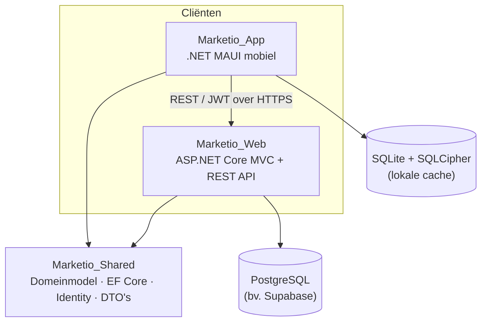

# Marketio

> Een full-stack e-commerceplatform gebouwd als **multi-tier .NET 9-oplossing**, met een webapplicatie (ASP.NET Core MVC + REST API), een mobiele app (.NET MAUI) en een gedeelde domeinbibliotheek.

## Inhoudsopgave

- [Over het project]
- [Architectuur]
- [Technologie-stack]
- [Projectstructuur]
- [De projecten in detail]
- [Marketio_Shared]
- [Marketio_Web]
- [Marketio_App]
- [Databank]
- [Vereisten]
- [Installatie & configuratie]
- [De applicaties uitvoeren]
- [Demo-accounts]
- [API-documentatie]
- [Beveiliging]
- [Lokalisatie]
- [AVG / GDPR-compliance]
- [Bijdragen]
- [Licentie]

## Over het project

**Marketio** is een e-commerceplatform dat aantoont hoe één gedeeld domeinmodel kan worden hergebruikt over twee verschillende cliënttechnologieën heen.
De solution bestaat uit drie projecten die samen één Visual Studio-solution vormen (`Marketio.sln`):

| Project | Type | Doel |
|---------|------|------|
| **Marketio_Shared** | Klassenbibliotheek | Domeinmodel, EF Core `DbContext`, Identity-model, DTO's en interfaces — gedeeld door alle andere projecten. |
| **Marketio_Web** | ASP.NET Core MVC + REST API | Publieke webwinkel, beheerportaal en de REST API die de mobiele app aanstuurt. |
| **Marketio_App** | .NET MAUI mobiele app | Cross-platform klant-app (Android, iOS, macOS, Windows) met offline-ondersteuning. |

De volledige oplossing draait op **.NET 9** en is ontwikkeld met Visual Studio 2022 (v17.14+).

## Architectuur



**Kernprincipes**

- **Gedeeld domein:** entiteiten, enums, DTO's en het `MarketioDbContext` leven uitsluitend in `Marketio_Shared`. De webapplicatie hergebruikt de `DbContext` rechtstreeks; de mobiele app hergebruikt enkel de DTO's en enums en communiceert verder via de REST API.
- **Eén databankprovider:** de webapplicatie werkt tegen **PostgreSQL** (via Npgsql); alle EF Core-migraties leven in `Marketio_Web/Migrations` (zie [Databank](#-databank)).
- **Offline-first mobiel:** de MAUI-app cachet gegevens lokaal in een versleutelde SQLite-databank en stuurt bestellingen door zodra er opnieuw verbinding is.
- **MVVM** in de MAUI-app, met `CommunityToolkit.Mvvm` en dependency injection.

## Technologie-stack

| Categorie | Technologie |
|-----------|-------------|
| Framework | .NET 9 (C#) |
| Web | ASP.NET Core MVC, Razor Pages, REST API |
| Mobiel | .NET MAUI (`net9.0-android`, `-ios`, `-maccatalyst`, `-windows`) |
| ORM | Entity Framework Core 9 |
| Identiteit | ASP.NET Core Identity |
| Authenticatie API | JWT Bearer + refresh tokens |
| Databank | PostgreSQL (Npgsql) |
| Lokale opslag (Mobiel) | SQLite met SQLCipher-versleuteling (`sqlite-net-sqlcipher`) |
| MVVM | CommunityToolkit.Mvvm |
| API-documentatie | Swagger / OpenAPI (Swashbuckle) |
| Lokalisatie | `IStringLocalizer` + `.resx` (NL / EN / FR) |
| Frontend | Bootstrap, jQuery, jQuery Validation |

## Projectstructuur

```text
Marketio/
├── Marketio.sln
├── CONTRIBUTING.md                  # AVG/GDPR-richtlijnen
│
├── Marketio_Shared/                 # Gedeelde klassenbibliotheek
│   ├── Entities/                    # Customer, Order, OrderItem, Product, ProductTranslation, GdprAuditLog
│   ├── Models/                      # AppUser (IdentityUser)
│   ├── Enums/                       # OrderStatus, PaymentMethod, ProductCategory
│   ├── DTOs/                        # Product-, Order-, OrderItem-, CartItem-, CreateOrder-DTO's
│   ├── Interfaces/                  # IRepository<T>, IProduct/IOrder-repository & -service, ICartService
│   └── Data/                        # MarketioDbContext, DataSeeder
│
├── Marketio_Web/                    # ASP.NET Core MVC + REST API
│   ├── Controllers/                 # MVC- én API-controllers
│   ├── Areas/Identity/Pages/        # Gescaffolde Identity-pagina's (Login, Register, Manage, …)
│   ├── Views/                       # Razor-views (Home, Products, Orders, Cart, Privacy, …)
│   ├── Services/                    # JWT-, GDPR-, e-mail-, cart-, product- en order-services
│   ├── Repositories/                # ProductRepository, OrderRepository
│   ├── Middleware/                  # RequestLogging, CookieManagement
│   ├── Localization/                # LocalizedIdentityErrorDescriber
│   ├── Resources/                   # SharedResources.resx / .nl / .fr
│   ├── Migrations/                  # EF Core-migraties (PostgreSQL)
│   ├── wwwroot/                     # Bootstrap, jQuery, CSS, afbeeldingen
│   ├── Program.cs
│   └── appsettings.json
│
└── Marketio_App/                    # .NET MAUI mobiele app
    ├── Pages/                       # XAML-pagina's per scherm
    ├── ViewModels/                  # MVVM-viewmodels
    ├── Services/                    # ApiService, Auth-, Product-, Order-, Account-, Cart-,
    │                                #   Connectivity-, LocalDatabase-, SecureKeyManagement-service
    ├── Converters/                  # UI-converters (status/stock-kleuren, null-checks, …)
    ├── Resources/                   # Fonts, afbeeldingen, stijlen, splash, app-icoon
    ├── Platforms/                   # Platformspecifieke code (Android, iOS, MacCatalyst, Windows, Tizen)
    ├── AppShell.xaml                # Shell-navigatie (TabBar + routes)
    └── MauiProgram.cs               # DI-container & opstartlogica
```

## De projecten in detail

### Marketio_Shared — gedeelde klassenbibliotheek
Het hart van de oplossing. Deze bibliotheek bevat alles wat tussen de cliënten gedeeld wordt, zodat het domeinmodel maar op één plek gedefinieerd is.

**Entiteiten**

- `Product` — met prijs, voorraad, categorie en afbeelding. Heeft een collectie `ProductTranslation`-records voor meertalige naam/beschrijving.
- `ProductTranslation` — vertaling per `Locale` (`nl`, `fr`, `en`); uniek per `(ProductId, Locale)`.
- `Order` & `OrderItem` — bestellingen met statusverloop en regelitems.
- `Customer` — klantgegevens.
- `GdprAuditLog` — auditspoor voor elke toestemmings-, export- of verwijderingsactie (AVG).

**Identity**

- `AppUser` breidt `IdentityUser` uit met o.a. `FirstName`, `LastName`, `Address`, `CreatedAt`, `LastLoginAt`, `IsActive` en de AVG-velden (`PrivacyConsentGiven`, `TermsConsentGiven`, `MarketingOptIn`, `ConsentGivenDate`, `IsDeletionRequested`, `DeletionRequestedDate`).

**Enums** — `OrderStatus` (Pending, Processing, Shipped, Delivered, Cancelled), `PaymentMethod` (CreditCard, DebitCard, PayPal, BankTransfer, Cash) en `ProductCategory` (Electronics, Clothing, Books, HomeAndGarden, Sports).

**Datalaag**

- `MarketioDbContext` erft van `IdentityDbContext<AppUser, IdentityRole, string>` en configureert sleutels, unieke indexen, decimale precisie (18,2) en **globale query-filters voor soft-delete** (`IsActive`).
- `DataSeeder` vult de databank met rollen, demo-gebruikers, producten, vertalingen, klanten en bestellingen.

> Validatieboodschappen zijn als **resource-sleutels** gedefinieerd (bv. `Validation_Product_Name_Required`), zodat foutmeldingen volledig vertaalbaar zijn.

**NuGet-pakketten:** `Microsoft.AspNetCore.Identity.EntityFrameworkCore` (9.0). EF Core-tooling en het databankprovider-pakket leven uitsluitend in `Marketio_Web`.

### Marketio_Web — ASP.NET Core MVC + REST API
De webapplicatie combineert een MVC-frontend, gescaffolde Identity-pagina's én een REST API in één project.

**Functionaliteit**

- **Productcatalogus** met zoeken, filteren op categorie en prijs, en sorteren (`ProductsController.Index`).
- **Winkelwagen** (sessiegebaseerd) met AJAX-endpoints voor het aantal artikelen en een samenvatting.
- **Bestelproces** met afrekenen en plaatsen van bestellingen.
- **Beheer** van producten (CRUD, rolgebonden), gebruikers en rollen.
- **AVG-portaal**: privacyvoorkeuren, gegevensexport, verwijderingsaanvragen en auditlogs.
- **REST API** voor de mobiele app, beveiligd met JWT.
- **Swagger/OpenAPI** in ontwikkeling op `/api-docs`.

**Identity & beveiliging**
- ASP.NET Core Identity met `AppUser`; e-mailbevestiging vereist, accountvergrendeling na 5 mislukte pogingen (15 min) en wachtwoordregels.
- JWT Bearer-authenticatie voor de API, met **refresh tokens** (`JwtTokenService` + `RefreshTokenStore`).
- `LocalizedIdentityErrorDescriber` voor vertaalde Identity-foutmeldingen.

**Middleware** — `RequestLoggingMiddleware` (logging) en `CookieManagementMiddleware` (cookietoestemming).
**Services** — `ProductService`, `OrderService`, `CartService`, `JwtTokenService`, `RefreshTokenStore`, `GdprAuditService` en `EmailSenderService` (met mock-e-mail voor ontwikkeling).
**Databank:** PostgreSQL via `Npgsql.EntityFrameworkCore.PostgreSQL`. Migraties bevinden zich in `Marketio_Web/Migrations`. Bij het opstarten worden migraties automatisch toegepast en wordt de databank geseed.
**NuGet-pakketten (selectie):** `Microsoft.AspNetCore.Authentication.JwtBearer`, `Microsoft.AspNetCore.Identity.UI`, `Npgsql.EntityFrameworkCore.PostgreSQL`, `Microsoft.Extensions.Localization`, `Swashbuckle.AspNetCore`.

### Marketio_App — .NET MAUI mobiele app
De klant-app voor Android, iOS, macOS (Mac Catalyst) en Windows. De app praat met de REST API van **Marketio_Web** en werkt ook **offline**.

**Functionaliteit**

- **Aanmelden/registreren** tegen de API met JWT; tokens worden veilig opgeslagen in `SecureStorage`.
- **Productlijst** en **productdetail**.
- **Winkelwagen** en **bestelproces** (nieuwe bestelling plaatsen).
- **Bestellingen** bekijken met detailweergave.
- **Accountinstellingen** met AVG-functies (toestemming, gegevensexport, verwijderingsaanvraag).
- **Offline-modus**: producten en bestellingen worden lokaal gecachet; bestellingen die offline worden geplaatst, komen in een wachtrij (`PendingOrder`) en worden gesynchroniseerd zodra er weer verbinding is.

**Architectuur & beveiliging**

- **Shell-navigatie** met een TabBar (*Producten*, *Winkelwagen*, *Bestellingen*, *Instellingen*) en aparte routes voor aanmelden en detailpagina's.
- **MVVM** met `CommunityToolkit.Mvvm`; services en viewmodels via DI in `MauiProgram.cs`.
- `ApiService` als centrale HTTP-laag, inclusief automatische **token-refresh** bij een `401`-respons.
- `SecureKeyManagementService` genereert en bewaart een **256-bit AES-sleutel** in de native beveiligde opslag (Keychain/Keystore) voor de SQLCipher-databank.
- `LocalDatabaseService` beheert de **versleutelde SQLite-databank** (cache + wachtrij).
- `ConnectivityService` detecteert online/offline-overgangen.
- In ontwikkeling vertrouwt de `HttpClient` zelfondertekende ontwikkelcertificaten (enkel in `DEBUG`).

> **API-basis-URL per platform** (poort `7170`): Android `https://10.0.2.2:7170/`, iOS/macOS/Windows `https://localhost:7170/`.

**NuGet-pakketten (selectie):** `Microsoft.Maui.Controls`, `Microsoft.Extensions.Http`, `CommunityToolkit.Mvvm`, `sqlite-net-sqlcipher`, `System.IdentityModel.Tokens.Jwt`.

## Databank

Marketio gebruikt **één databankprovider** voor de volledige oplossing:

| Project | Provider | Migratiemap | Connectiestring |
|---------|----------|-------------|-----------------|
| **Marketio_Web** | PostgreSQL (Npgsql) | `Marketio_Web/Migrations` | `ConnectionStrings:DefaultConnection` (via User Secrets / config) |

> De mobiele app deelt **geen** databank: die werkt via de REST API en bewaart enkel een lokale SQLite-cache.

**Migratiecommando (voorbeeld)**

```bash
# PostgreSQL-migraties (Web)
dotnet ef migrations add <Naam> --project Marketio_Web --startup-project Marketio_Web
```

## Vereisten

- [.NET 9 SDK](https://dotnet.microsoft.com/download/dotnet/9.0)
- Visual Studio 2022 (v17.14+) met de workloads:
  - **ASP.NET en webontwikkeling**
  - **.NET Multi-platform App UI-ontwikkeling** (voor MAUI)
- Een **PostgreSQL**-databank (bv. lokaal of via [Supabase](https://supabase.com/)) voor de webapplicatie
- Voor de MAUI-app: een Android-emulator, iOS-simulator (macOS) of Windows-machine

## Installatie & configuratie

```bash
git clone https://github.com/SoufianeAbk/Marketio.git
cd Marketio
dotnet restore
```

Gevoelige instellingen worden buiten de broncode gehouden via **User Secrets**.

### 1. Webapplicatie (Marketio_Web)
Stel minstens de connectiestring en de JWT-sleutel in:

```bash
cd Marketio_Web

dotnet user-secrets set "ConnectionStrings:DefaultConnection" \
  "Host=<host>;Port=<poort>;Database=<db>;Username=<gebruiker>;Password=<wachtwoord>"

dotnet user-secrets set "JwtSettings:SecretKey" "<een-lange-willekeurige-geheime-sleutel>"
```

De overige JWT-instellingen (`Issuer`, `Audience`, `ExpirationInMinutes`) en e-mailinstellingen staan in `appsettings.json`. Standaard wordt **mock-e-mail** gebruikt (`EmailSettings:UseMockEmail = true`).

### 2. Mobiele app (Marketio_App)
Zorg dat de webapplicatie draait op `https://localhost:7170` (of pas `GetPlatformApiBaseUrl()` in `MauiProgram.cs` aan voor jouw omgeving). Op Android wijst `10.0.2.2` naar de host-machine.

## De applicaties uitvoeren

```bash
# Webapplicatie (REST API + website)
dotnet run --project Marketio_Web
#   → website + Swagger op https://localhost:7170/api-docs (in Development)

# MAUI-app (kies het gewenste platform)
dotnet build Marketio_App -t:Run -f net9.0-android
dotnet build Marketio_App -t:Run -f net9.0-windows10.0.19041.0
```

> In Visual Studio kun je de projecten ook rechtstreeks als opstartproject selecteren en uitvoeren.

## Demo-accounts

De `DataSeeder` maakt automatisch de volgende accounts aan:

| Rol | E-mail | Wachtwoord |
|-----|--------|-----------|
| **Admin** | `admin@marketio.be` | `Admin@12345` |
| **Manager** | `manager@marketio.be` | `Manager@12345` |
| **Customer** | `user@marketio.be` | `User@12345` |

> Deze accounts zijn uitsluitend bedoeld voor lokale ontwikkeling en testen.

## API-documentatie
Alle endpoints (behalve `api/auth`) vereisen een geldige **JWT Bearer-token**. De volledige, interactieve documentatie is beschikbaar via Swagger op `/api-docs` (in Development).

### Authenticatie — `api/auth`

| Methode | Endpoint | Beschrijving |
|---------|----------|--------------|
| `POST` | `/api/auth/login` | Aanmelden, geeft JWT + refresh token terug |
| `POST` | `/api/auth/register` | Nieuw account registreren |
| `POST` | `/api/auth/refresh` | Nieuwe JWT verkrijgen met een refresh token |
| `POST` | `/api/auth/logout` | Refresh tokens intrekken |

### Producten — `api/products` *(JWT vereist)*

| Methode | Endpoint | Rol |
|---------|----------|-----|
| `GET` | `/api/products` | Alle gebruikers |
| `GET` | `/api/products/{id}` | Alle gebruikers |
| `POST` | `/api/products` | Admin, Manager |
| `PUT` | `/api/products/{id}` | Admin, Manager |
| `DELETE` | `/api/products/{id}` | Admin |

### Bestellingen — `api/orders` *(JWT vereist)*

| Methode | Endpoint | Beschrijving |
|---------|----------|--------------|
| `GET` | `/api/orders/my-orders` | Bestellingen van de aangemelde gebruiker |
| `GET` | `/api/orders/{id}` | Eén bestelling ophalen |
| `POST` | `/api/orders` | Nieuwe bestelling plaatsen |
| `POST` | `/api/orders/{id}/cancel` | Bestelling annuleren |
| `DELETE` | `/api/orders/{id}` | Bestelling verwijderen (soft-delete) |

### Account & AVG — `api/account` *(JWT vereist)*

| Methode | Endpoint | Beschrijving |
|---------|----------|--------------|
| `GET` | `/api/account/profile` | Profielgegevens ophalen |
| `POST` | `/api/account/consent` | Toestemmingen bijwerken |
| `GET` | `/api/account/export-data` | Persoonsgegevens exporteren |
| `POST` | `/api/account/request-deletion` | Accountverwijdering aanvragen |
| `GET` | `/api/account/audit-trail` | Eigen AVG-auditspoor opvragen |

## Beveiliging
- **JWT Bearer-authenticatie** met validatie van issuer, audience, levensduur en handtekening (`ClockSkew = 0`).
- **Refresh tokens** voor een naadloze sessie zonder voortdurend opnieuw aanmelden.
- **ASP.NET Core Identity** met wachtwoordregels, e-mailbevestiging en accountvergrendeling.
- **Rolgebaseerde autorisatie** (Admin, Manager, Customer) op zowel de website als de API.
- **Versleutelde lokale opslag** op mobiel via SQLCipher, met sleutelbeheer in de native veilige opslag.
- **Veilige opslag van geheimen** via User Secrets (connectiestrings, JWT-sleutel staan niet in de broncode).

## Lokalisatie

De webapplicatie ondersteunt drie talen: **Nederlands (standaard)**, **Engels** en **Frans**.
- Vertalingen staan in `Resources/SharedResources.resx`, `.nl.resx` en `.fr.resx` (elk ± 393 keys).
- Taal wordt bepaald via de querystring of een cookie (`QueryStringRequestCultureProvider` + `CookieRequestCultureProvider`); wisselen kan via `CultureController`.
- Validatieboodschappen en Identity-fouten zijn eveneens vertaald.
- Producten hebben meertalige naam/beschrijving via `ProductTranslation`.

## AVG / GDPR-compliance
Privacy zit ingebouwd in alle lagen. Zie [`CONTRIBUTING.md`](CONTRIBUTING.md) voor de volledige richtlijnen.

- **Expliciete toestemming** bij registratie (aparte checkboxes voor privacybeleid en algemene voorwaarden, geen vooraf aangevinkte vakjes).
- **Recht op vergetelheid**: gebruikers kunnen accountverwijdering aanvragen (web én mobiel).
- **Gegevensexport** voor de aangemelde gebruiker.
- **Auditspoor** (`GdprAuditLog`) van elke toestemmings-, export- en verwijderingsactie, met tijdstip, gebruiker-ID, type en IP-adres.
- **Cookiebanner** met beheer van voorkeuren.
- **AVG-metadata** op `AppUser` (`PrivacyConsentGiven`, `TermsConsentGiven`, `MarketingOptIn`, `ConsentGivenDate`, …).

## Dit is een educatief project en niet bedoeld voor commercieel gebruik.
- **Auteur**: Abakkiou Soufiane
- **Email**: soufiane.abakkiou@student.ehb.be

## Externe Bronnen + AI-gegenereerde Code
https://learn.microsoft.com/en-us/dotnet/maui/?view=net-maui-10.0
https://learn.microsoft.com/fr-fr/aspnet/core/?view=aspnetcore-10.0
https://chatgpt.com/c/6a2edc03-3d90-83eb-ad75-4a19ab6f1ef3
https://claude.ai/share/f2bc5d37-d4fa-4018-a957-4f2aaf3866ae
https://claude.ai/share/8811aade-b6f5-40d9-9644-09e40d722927
https://chatgpt.com/c/6a2ba814-3ce8-83eb-bdf9-25e88cee828f

## Copyright: ©2026 Marketio. Alle rechten voorbehouden.
